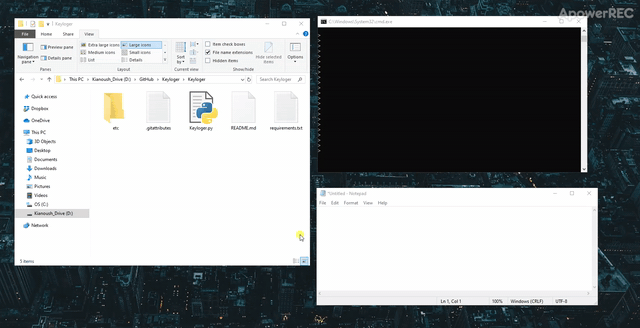

# Keylogger
 
I created a simple keylogger that saves every 10 keyboard inputs into a text file.

The code starts capturing any keyboard inputs, and if the user presses "ESC," the code stops. 





### What is a keylogger used for?
A keylogger (short for keystroke logger) is software that tracks or logs the keys struck on your keyboard, typically in a covert manner so that you don't know that your actions are being monitored.

### Can a keylogger be detected?
Detecting keyloggers can range from being very easy to very difficult depending upon how and what was installed. Keyloggers can be installed through random infections or through direct access to your device.


Moreover, please feel free to give us your feedback to share your experience.

Email: haratiank2@gmail.com


## Install

### Dependencies

You need the following dependencies:

- python3
- pynput


### Install repo and requirements

Clone the repo and install 3rd-party libraries.

```bash
$ git clone https://github.com/Kianoush-h/Keyloger.git
$ cd Keyloger
$ pip3 install -r requirements.txt
```


## Demo

You can test the the code with this:

```
$ python3 Keyloger.py
```


Then you will see the screen as below :


## Future

For the next step I will create an anti-keloger to detect keyloggers on a computer,


# Contact Me

Email: haratiank2@gmail.com

YouTube channel: https://www.youtube.com/channel/UCvf9_53f6n3YjNEA4NxAkJA?view_as=subscriber

GitHub: https://github.com/Kianoush-h

LinkedIn: https://www.linkedin.com/in/kianoush-haratiannejadi/
